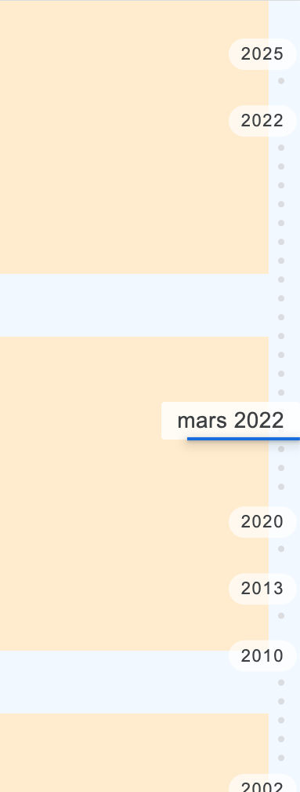

# timeline-vertical-navigation

Navigate in time same way as Google Photos.
_Built with [StencilJS](https://stenciljs.com/)_

[](https://timeline-vertical-navigation.herokuapp.com/)

## Properties

| Property             | Attribute          | Description | Type               | Default     |
| -------------------- | ------------------ | ----------- | ------------------ | ----------- |
| `darkmode`           | `darkmode`         |             | `boolean`          | `false`     |
| `dates` _(required)_ | `dates`            |             | `Date[] or string` | `undefined` |
| `opaquebackground`   | `opaquebackground` |             | `boolean`          | `false`     |
| `pinned`             | `pinned`           |             | `boolean`          | `false`     |

## Events

| Event          | Description | Type                |
| -------------- | ----------- | ------------------- |
| `dateSelected` |             | `CustomEvent<Date>` |

## Methods

`updateSelectedDate(date: Date) => void`

## Example with native HTML & JavaScript

For the demo, there is an "items-grid" component you can find in source, this is an example of what your scrollable component could be.

```html
<timeline-vertical-navigation
  dates="2020-03-31, 2022-09-12, 2022-04-01, 2022-03-12, 2022-03-13, 2022-03-14, 2022-03-15, 2000-01-01, 2010-12-01, 2013-10-01, 2010-11-21, 1998-07-28, 2000-01-01, 2000-01-11, 2002-03-11, 2002-04-11, 2002-04-12, 2025-01-01"
></timeline-vertical-navigation>
<script>
  const timelineVerticalNavigation = document.querySelector('timeline-vertical-navigation');
  timelineVerticalNavigation.addEventListener('dateSelected', e => {
    const selectedDate = e.detail;
    // You can scroll into your scrollable component to the selected date
    {yourScrollableComponent}.scrollToDate(selectedDate);
  });
  // Then your scrollable component need to dispatch which date is currently displayed in order to update the selected date
   {yourScrollableComponent}.addEventListener('scrolledToDate', e => {
        const firstDateVisible = e.detail;
        const timelineVerticalNavigation = document.querySelector('timeline-vertical-navigation');
        timelineVerticalNavigation.updateSelectedDate(firstDateVisible);
      });
</script>
```

### [Online demo](https://timeline-vertical-navigation.herokuapp.com/)
